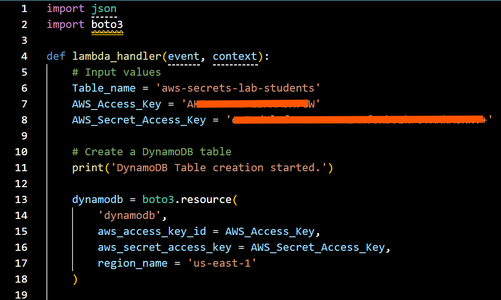
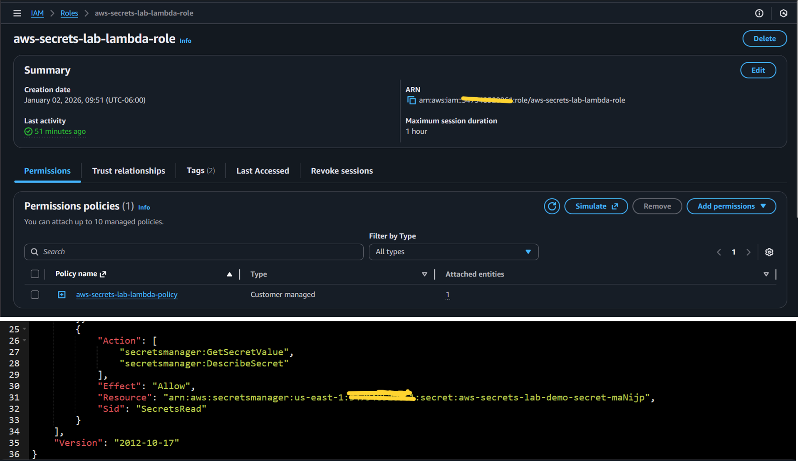
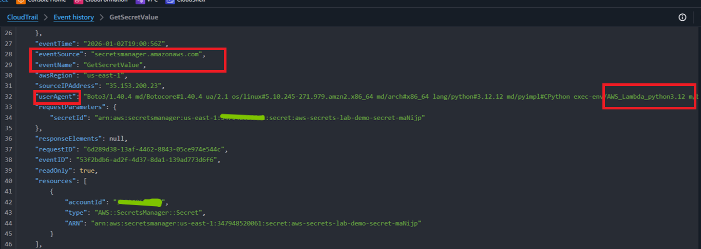
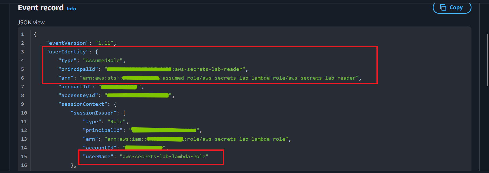
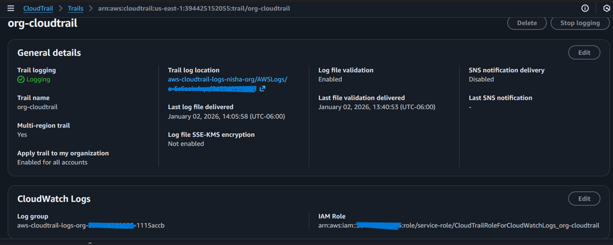
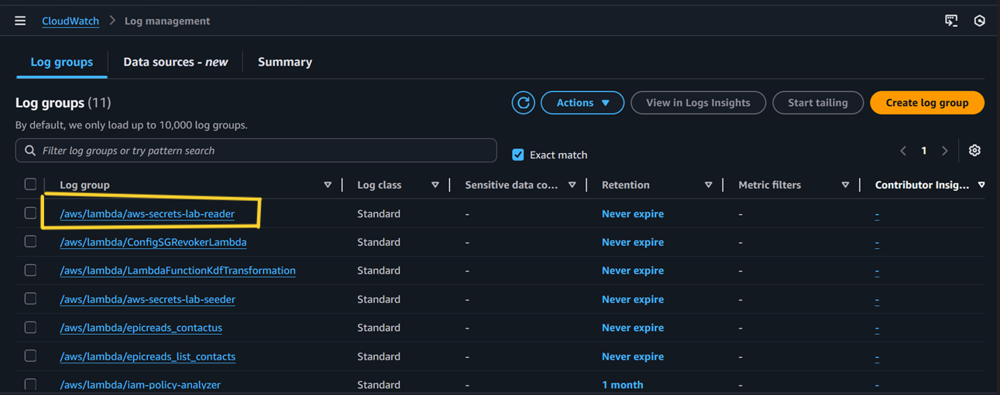
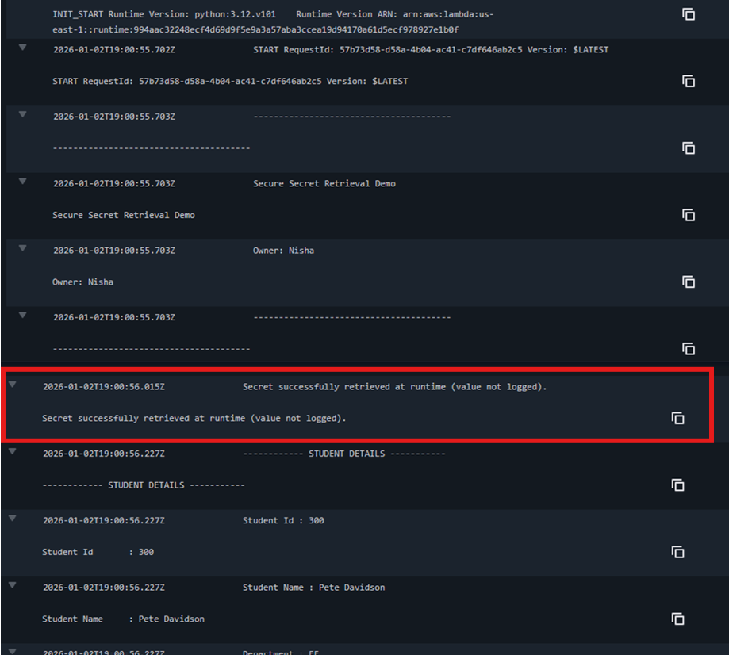
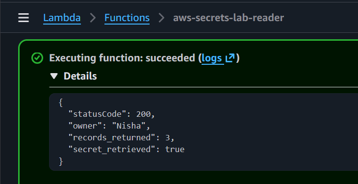

# Secure Secret Retrieval in AWS Lambda

## Overview

This lab demonstrates a secure approach to handling sensitive credentials and configuration values in AWS Lambda by eliminating hardcoded secrets and retrieving protected values from AWS Secrets Manager at runtime.

The objective of this lab is to evaluate **security posture, identity enforcement, and auditability**, rather than to provide a step-by-step service tutorial. The implementation emphasizes evidence-backed validation using AWS-native telemetry.

---

## Architecture Context

*High-level architecture showing an AWS Lambda function retrieving sensitive configuration values from AWS Secrets Manager at runtime to access a DynamoDB table without embedding credentials in code.*

---

## Insecure Baseline: Hardcoded Credentials

The initial Lambda implementation embedded AWS access keys directly within the function source code.

*Initial Lambda implementation embedding AWS access keys directly in source code, representing a high-risk credential handling pattern that increases exposure and complicates rotation.*

This pattern introduces multiple risks:
- Credentials are exposed to anyone with code access
- Secrets may be committed to version control
- Rotation requires redeployment
- Audit visibility is reduced

---

## Secure Implementation: Secrets Manager

To mitigate these risks, sensitive values normally stored as environment variables or embedded credentials were moved into AWS Secrets Manager and retrieved dynamically at runtime.

This approach ensures:
- Sensitive configuration is not visible in Lambda configuration metadata
- Secrets are encrypted at rest using AWS KMS
- Values are retrieved only when needed and handled in memory

---

## IAM Authorization Boundary

The Lambda function executes using an assigned IAM execution role that governs access to Secrets Manager and DynamoDB.

*IAM execution role assigned to the Lambda function, serving as the workload identity used to authorize access to AWS Secrets Manager and downstream resources.*

*Customer-managed IAM policy granting least-privilege access to retrieve and describe a single Secrets Manager secret used by the Lambda function.*

---

## CloudTrail Evidence: Secret Retrieval and Identity

CloudTrail provides authoritative evidence of how secrets were accessed and which identity performed the action.

*CloudTrail event confirming invocation of the `GetSecretValue` API by the Lambda service, validating that secret retrieval occurred through AWS Secrets Manager rather than embedded credentials.*

*CloudTrail session context showing the Lambda function assuming an IAM role via STS-issued temporary credentials, providing full identity attribution and auditability.*

---

## Audit Coverage

Audit logging is enforced at the organizational level to ensure durability and centralized visibility.

*Organization-level CloudTrail configuration confirming centralized, multi-region audit logging for Secrets Manager and Lambda activity.*

---

## Runtime Validation (CloudWatch Logs)

CloudWatch logs confirm correct runtime behavior without exposing sensitive material.

*CloudWatch log groups associated with the Lambda function, providing runtime visibility into execution behavior and application output.*

*Lambda runtime logs confirming successful secret retrieval at execution time while explicitly suppressing secret values from log output.*

---

## Functional Validation

The Lambda function executed successfully after credential hardening, confirming no functional regression.

*Successful Lambda execution response demonstrating functional parity after credential hardening, including DynamoDB access and validated secret retrieval.*

---

## Security Tradeoffs and Migration Path

AWS Secrets Manager was intentionally used as a **transitional control** to eliminate hardcoded credentials and plaintext configuration exposure.

While Secrets Manager improves security and auditability, it still relies on stored static secrets.

**Target end state:**
- IAM role-based access using STS-issued temporary credentials
- No stored AWS credentials
- Secrets Manager reserved for non-AWS or external secrets only

---

## Zero Trust Alignment

This implementation aligns with Zero Trust principles by:
- Enforcing workload identity through IAM roles
- Applying least privilege at the API authorization layer
- Removing implicit trust in embedded credentials
- Continuously verifying access through CloudTrail telemetry

---

## RMF / NIST 800-53 Alignment

- IA-5 – Authenticator Management  
- IA-7 – Cryptographic Module Authentication  
- AC-6 – Least Privilege  
- SC-12 – Cryptographic Key Establishment and Management  
- AU-2 / AU-12 – Audit Generation  

---

## Notes

This lab was validated in a controlled environment to demonstrate secure credential and configuration handling patterns applicable to production AWS Lambda workloads.

